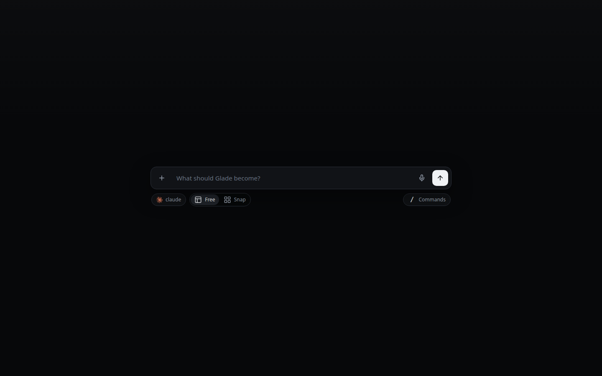
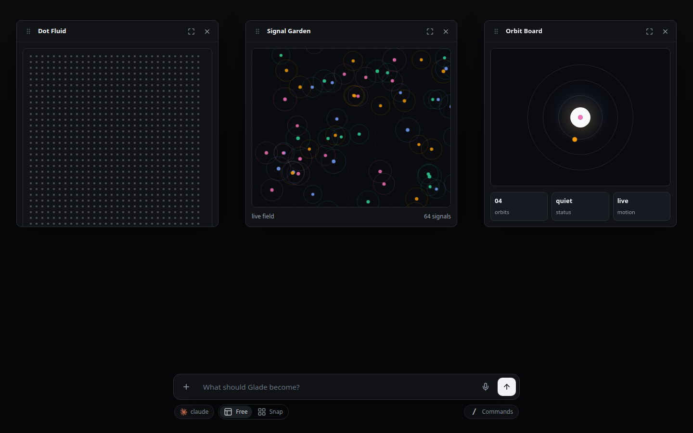
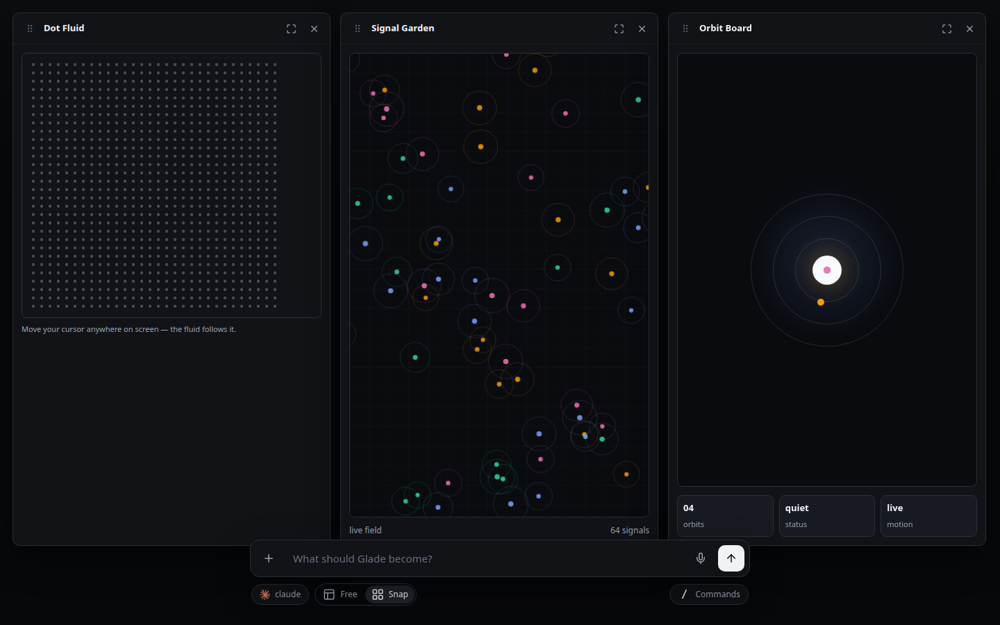
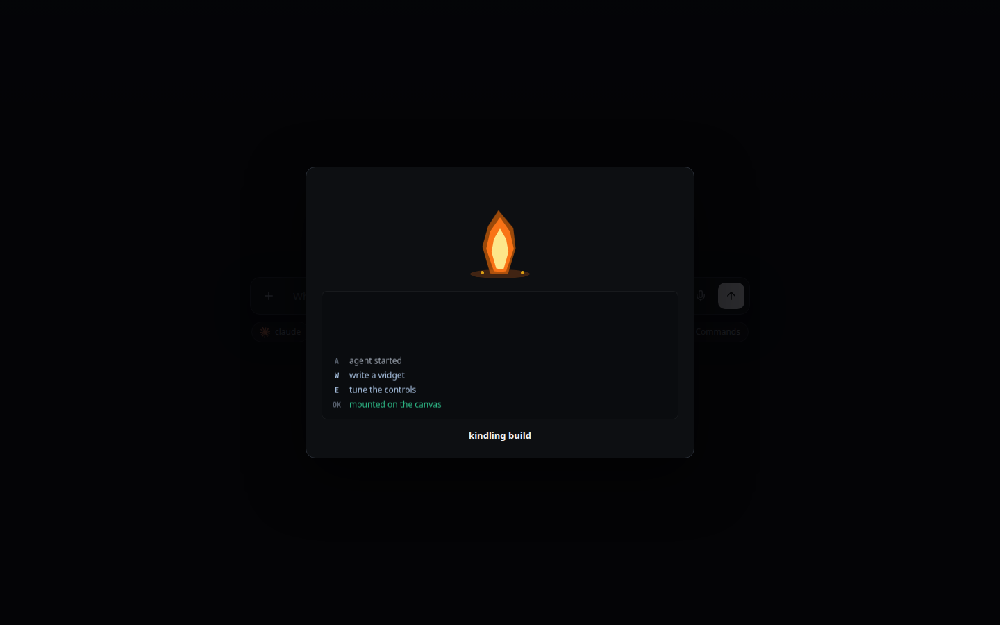

# Glade

Glade is a toy, used for asking your agent harness to build small widgets.

A timer. A dashboard. A strange dot field. A tiny 3D mars landing mission console. The kind of thing too small and specific to deserve a whole app, the kind of thing that you will play around with for a few minutes and then forget.

You type, and Glade grows widgets. You move them around like a little operating system with questionable priorities.



## Why This Is Fun

- Start with nothing. It's a blank canvas begging you to create something.
- Ask for something weirdly specific.
- Watch Claude or Codex build it.
- Snap the mess into panels when you want to pretend to be organized.
- Go back to floating windows when you realize the panel view is dogshit.



## Windows Behaving, Briefly

Glade can float, snap, maximize, and can act like it actually does window management well. This is useful when the widgets are useful, and still satisfying when they are just pretty lights.



## The Little Fire

When the harness is building, Glade shows you a tiny flame. Whatever you do, don't click on it three times!



## Run

```sh
npm i
npm start
```

Open the local URL it prints. Bring an agent harness. Bring unreasonable requests.
