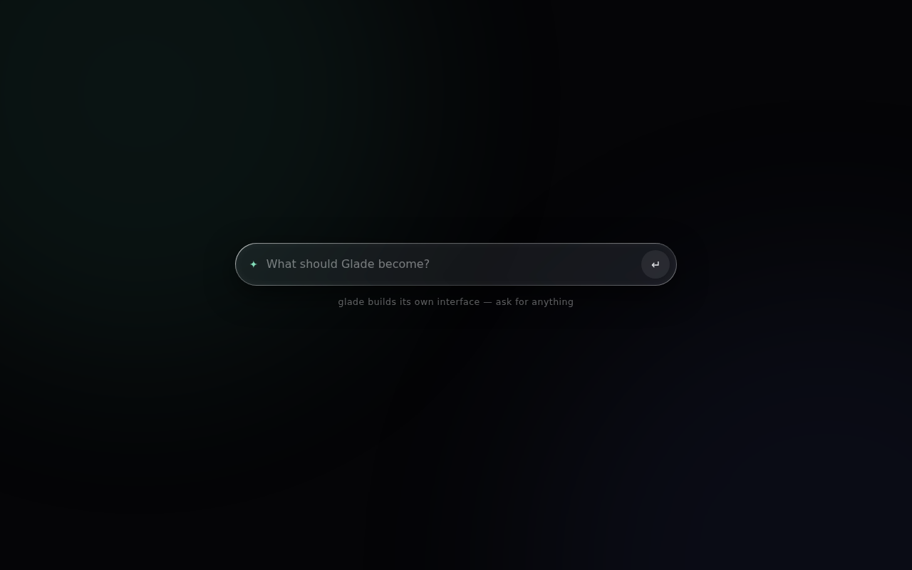
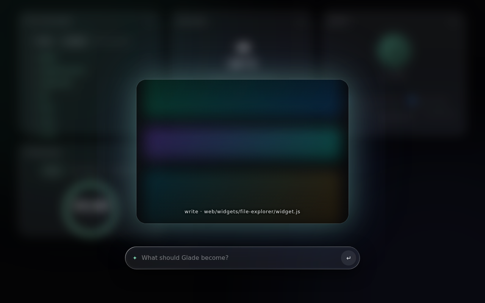
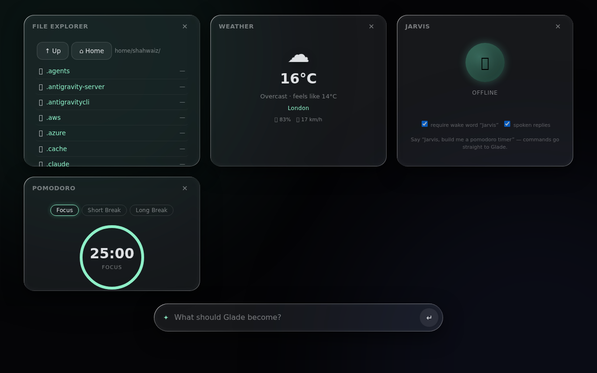
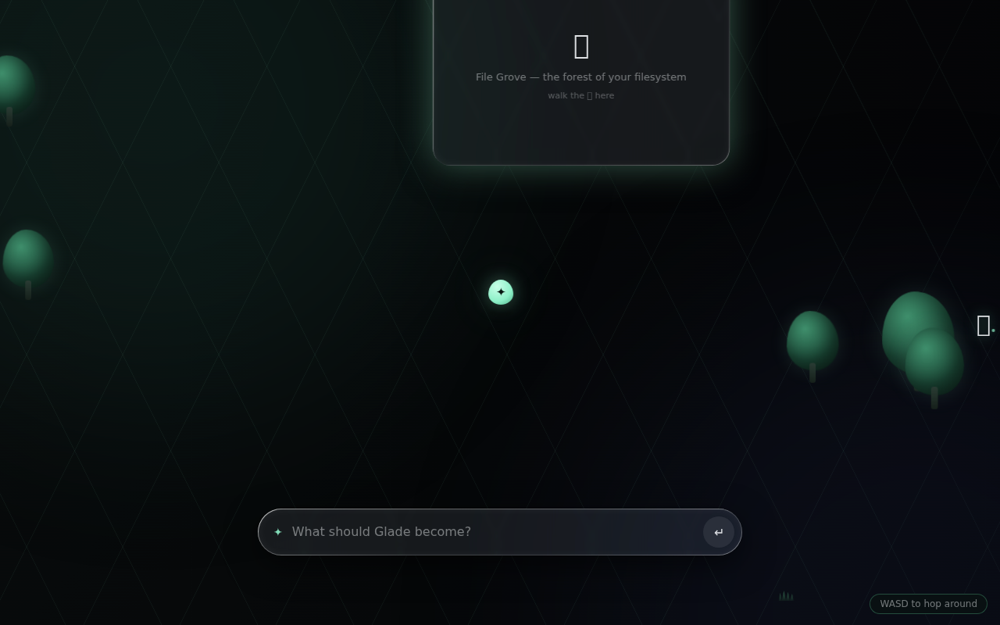

# ✦ Glade

A UI that builds itself. Glade starts as a black screen with one input. Describe what you want — a file explorer, a weather card, a pomodoro timer — and a coding harness (Claude Code or Codex) writes the widget, writes its backend, wires them up, and mounts it live. No reloads, no scaffolding, no config.



## Run

```sh
npm start
# → http://localhost:4173
```

Needs Node 18+ and the `claude` CLI on PATH. To use Codex instead, set `{ "harness": "codex" }` in `glade.config.json`. Zero npm dependencies.

## How it works

Type a request. While the harness works, Glade shows what it's doing:



The server runs the harness headlessly inside this folder. `CLAUDE.md` is its contract: build a UI module in `web/widgets/<slug>/`, an optional Node backend in `backends/<slug>.js`, register both in the manifest. Backends are hot-loaded on every call, so new widgets appear without restarting anything.



It isn't limited to widgets. Ask for something weirder — *"make a game engine and show a walking character walking around the widgets"* — and the harness extends Glade's own shell: an isometric world grows under the grid, the widgets become places, and you hop between them with WASD.



If a widget needs an API key, a panel slides in asking for just that value — keys prefilled, paste and go. Widgets that only touch your machine (files, processes, git) need nothing at all.

## Layout

```
server.js                      zero-dep server + harness runner
CLAUDE.md                      the contract the harness follows
web/                           the shell
web/widgets/<slug>/widget.js   widget UIs (harness-generated)
backends/<slug>.js             widget backends (harness-generated, hot-loaded)
.env                           secrets (gitignored)
```
